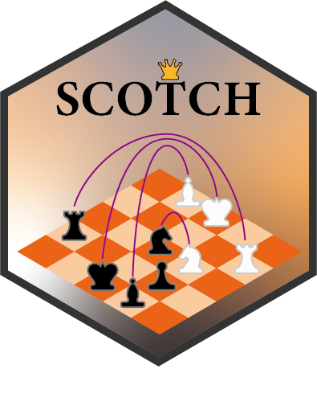
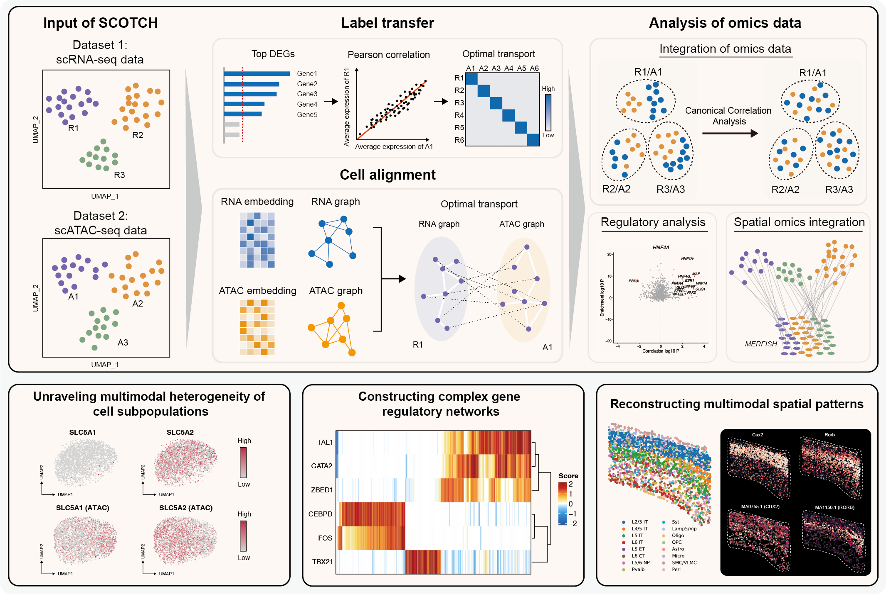

  
  

#  SCOTCH v1.0.0 </a>

  


## Cross-modal matching and integration of single-cell multi-omics data

  

### Penghui Yang<sup></sup>, Kaiyu Jin<sup></sup>, Lijun Jin<sup></sup>, ..., Xiaohui Fan*

  
  

SCOTCH is a computational method that leverages the optimal transport algorithm and a cell matching strategy to integrate scRNA-seq and scATAC-seq data. SCOTCH takes into account the adverse effects of **cell type abundance and cell number differences** on data integration during the calculation process, and **predicts cell pairing relationships** to meet the needs of downstream in-depth analysis.

  



  

##  Installation of SCOTCH


[](https://pypi.org/project/POT/0.8.2/) [](https://github.com/numpy/numpy/) [](https://github.com/pandas-dev/pandas/) [](https://github.com/scikit-learn/scikit-learn/) [](https://github.com/scipy/scipy/) [](https://pypi.org/project/scanpy/) [](https://github.com/scverse/anndata/) [](https://github.com/igraph/igraph/) [](https://pypi.org/project/louvain/0.7.1/) [](https://pypi.org/project/matplotlib/3.5.2/)


```

pip install scotch-sc

```

  

## Tutorials

  

We have applied SCOTCH on different tissues of multiple species, here we give step-by-step tutorials for application scenarios. And datasets in `.h5ad` fomat used can be downloaded from [Google Drive](https://drive.google.com/drive/folders/1_LIBzeq-C028RC802ZwyfcqxjobEHTm1?usp=sharing).

  
  

* [Using SCOTCH to integrate SHARE-seq data of mouse cerebral cortex](tutorial/1.Chen-2019.ipynb)

  

* [Using SCOTCH to integrate human kidney snRNA-seq and snATAC-seq datasets](tutorial/2.Muto-2021.ipynb)

  

* [Using SCOTCH to integrate mouse cerebral cortex MERFISH and scATAC-seq datasets](tutorial/3.mouse_brain.ipynb)

  

## About

Should you have any questions, please feel free to contact the author of the manuscript, Mr. Penghui Yang (yangph@zju.edu.cn).

  

## References